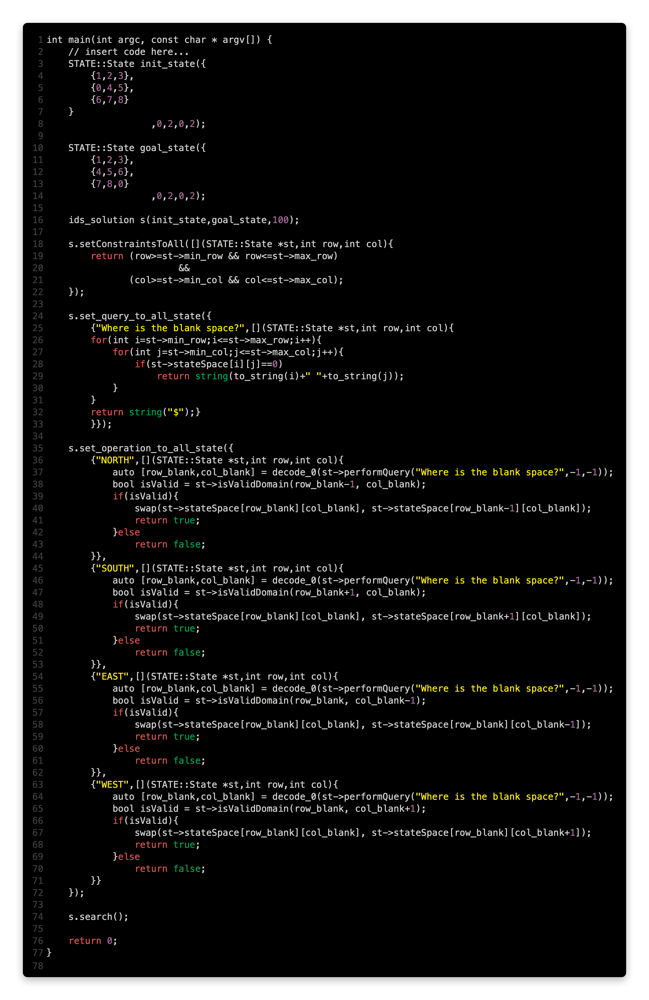
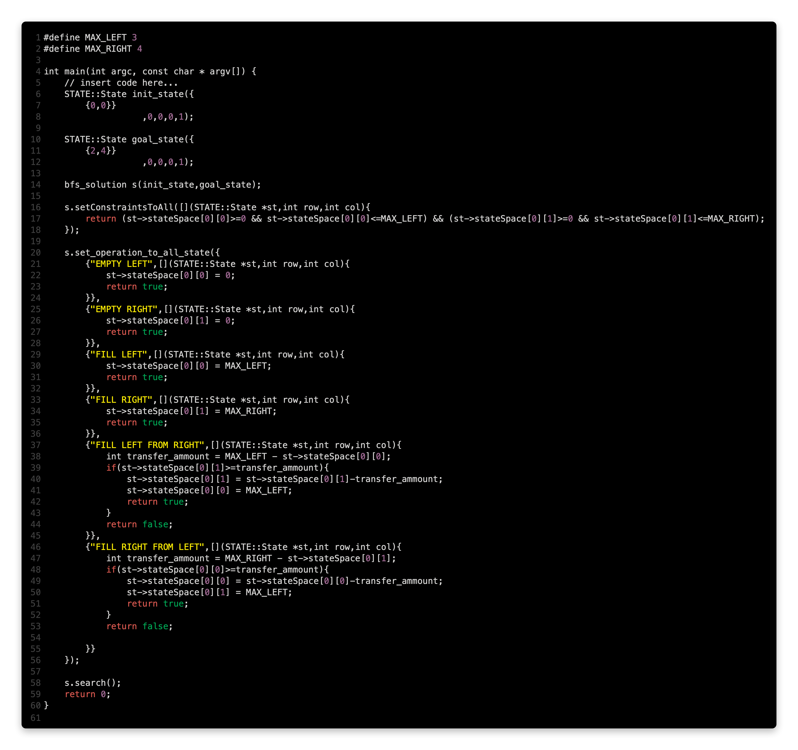

# Problem_Theory
My own domain to generalise problem solving (LoL) 
There is only one mysteriousa black box.
Intution any Turing Complete problem is on a 1D string. It can be mapped on 2D too. So, every such problem are on 2D space. 
# Users' job:
1. Add Rules And Constraints to the Black Box for your Chosen Task.
2. Add your Start and Goal State in the 2D Space.
3. Run .search() to reach your goal.

Hue Hue Hue!

## Here are two examples:
1. 8-Puzzle Problem

2. Water Jug Problem

